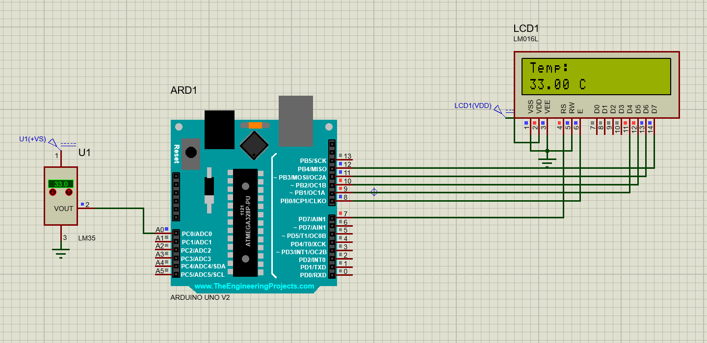
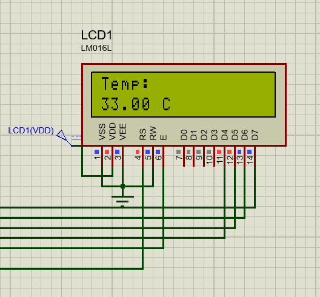

# LM35-Temperature-Sensor-with-Arduino-UNO-and-LCD
Arduino project to read temperature using LM35 Temperature sensor and displaying it on 16x2 LCD.

 📌 Project Overview

This project demonstrates how to interface an **LM35 temperature sensor** with an **Arduino UNO** and display the temperature on a **16x2 LCD**.
The circuit is simulated in **Proteus**.

* **Sensor Used:** LM35 (10mV/°C output)
* **Microcontroller:** Arduino UNO
* **Display:** 16x2 LCD
* **Software:** Arduino IDE + Proteus

🔧 Circuit Diagram (Proteus)

🧑‍💻 Code

#include <LiquidCrystal.h>

LiquidCrystal lcd(7, 8, 9, 10, 11, 12); // Adjust pins

int sensorPin = A0;  //Sensor output at A0 of Arduino
float tempC;  
float power=5000;// power source in mV
float bits=1024; // for ADC
float adcfac;

void setup() {
  lcd.begin(16, 2);
  lcd.print("Temp: ");
}

void loop() {
  int value = analogRead(sensorPin); // temperature reading
  adcfac= power/bits;
  tempC = int((value *adcfac) / 10); //10mV=1C

  lcd.setCursor(0, 1);
  lcd.print(tempC);
  lcd.print(" C");
  delay(1000);
}

🎯 How It Works

1. LM35 produces an analog voltage proportional to temperature (10mV per °C).
2. Arduino reads the analog value using its **10-bit ADC** (0–1023).
3. The value is converted into °C using the formula:

   Temperature = (analogValue * 500) / 1024
   
4. The temperature is displayed on a 16x2 LCD.

 📂 Files Included
* `LM35_interfacing.ino` → Arduino code
* `LM35Interfcing.pdsprj` → Proteus simulation file 
* `LM35Interfacing.png` → Circuit screenshot

🚀 Getting Started
1. Open the Arduino code in Arduino IDE.
2. Upload to Arduino UNO (if using hardware).
3. Or, open the `.pdsprj` file in Proteus to simulate.
   
📸 Output Example

